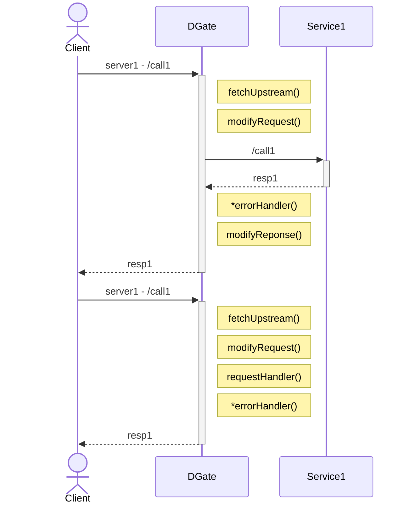
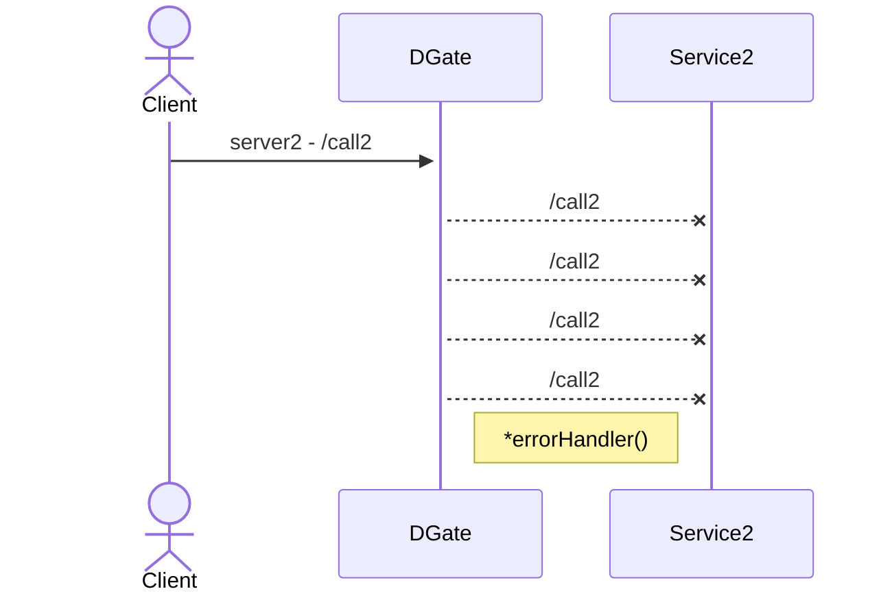

DGate (previously called RKX) is a dynamic module based API Gateway built in Go. It is designed to be a facile, fast, and flexible.

## API Gateway

An API Gateway is a server that acts as an entry point for clients. It is a reverse proxy that sits in front of one or more services.  The API Gateway can be used to handle authentication, retrying, circuit breaker logic, rate limiting, load balancing, and more. Please check out [this article](https://microservices.io/patterns/apigateway.html) for more information.

An API Gateway is a common pattern in microservice architectures, where each service is responsible for a specific task. DGate, for example, can route requests to different services based on the request path, request method and domain name. This allows you to build an infrastructure that operates under different names, but additionally .

## How does DGate differ?

DGate is an API Gateway and I plan to add all the features that you would expect from an API Gateway. However, DGate is different from other API Gateways in that it is built with support for dynamic modules. This means that you can write modules that can be loaded at runtime, without needing to restart the server. This allows you to build custom modules that can be used to handle/modify requests/responses throughout the request life cycle. For example, you can write a module that can be used to handle authentication, logging, or even custom business logic.

DGate also comes with a built-in admin API which has it's own embedded database. This allows you to manage your DGate instance using the admin API. The admin API can be used to create, update, delete, and view resources. The admin API can also be used to view logs, stats, and other information about your DGate instance.

The admin API also supports replication using the Raft consensus algorithm. This means that you can run multiple DGate instances and they will automatically replicate resources across all nodes. This allows you to build a highly available and scalable API Gateway.

### DGate Modules

DGate modules are scripts that are ran at runtime in particular functions. Modules can be built in TypeScript or JavaScript. Modules can be used to modify the request or response or handle the request/response in a custom way.

There are currently 5 types of modules:
- fetchUpstream - this module is used to select an upstream service url
- requestHandler - this module is used to handle the request, when a route has no service.
- errorHandler - this module is used to handle errors (network, timeouts, etc.).
- modifyRequest - this module is used to modify the request before it is sent to the upstream service (or before it is handled by the requestHandler).
- modifyResponse - this module is used to modify the response before it is sent to the client.

In the case of a non-http error (network, timeout, etc.), the errorHandler will be called instead of the modifyResponse. However, if the retries are not exhausted, the errorHandler will not be called until the retries are exhausted.
  

## Concepts

Namespaces - one or more domains/certs.
Routes - which are paths that are triggered when they hit the proxy
Services - one or more URLs (or a module for handling requests)
Consumer - these represent some way of recognizing the client.
Modules - scripts that are ran at runtime in particular functions

- Modules can be built in TypeScript or JavaScript
  - dynamic modules, meaning they can be loaded/replaced without needed to restart the server
- There is built-in support for:
  - Certification Mappings
  - Basic/JWT/Key Authentication
  - Canary + A/B Testing (Conditional Module Loading)
  - Transactional Rollouts
  - Versioning and rollbacks
  - Custom Stats

# DGate Client - `dgate-cli`

`dgate-cli` is a command line tool for managing DGate resources. I plan to also add the management of DGate instances, viewing DGate logs/stats, and other DGate features.

# Conclusion

## DGate vs Kong

DGate aims to bring the simplicity of Kong, but the flexibility of building it yourself utilizing dynamic modules.

DGate utilizes similar high-level concepts as Kong:
- Routes
- Services
- Modules (Plugins)

Kong Consumers do not exist in DGate, instead, DGate uses a different approach. DGate uses Collection/Documents to represent some arbitrary data. This allows you to create your own consumer system when used together with dynamic modules.

### Why not just use Kong?

While Kong is, hands down, one of the best API Gateways out there, it is not without its flaws. Kong is built in Lua (plugins too), which is a great language, but it is not as popular as JavaScript or TypeScript. This means that it is harder to find developers who are familiar with Lua, and more importantly, who are willing to write modules in Lua. Plugins cannot be dynamically loaded, meaning it will require a restart, which can be a hassle depending on your setup and uptime requirements, not to mention rollbacks. Additionally, deploying Kong can be complex, as you may need a database depending on what features you want to use.

TLDR: lua sucks (unpopular), complex deployment, restart to update plugins, enterprise paywall features and overall, not so flexible.

DGate aims to solve these problems by using JavaScript/TypeScript, with dynamic deployments and by having an internal state management and replication system. This will ensure that DGate is easy to deploy and maintain.

## Release Plan

I plan to release the beta version of DGate at the end of this year (2023). I am currently dogfooding DGate in several of my projects. In the process of prioritizing, refactoring and testing; just trying to think of many ways how DGate can/will be used and trying to design the application in a way that is scalable, yes flexible, and easy to use.