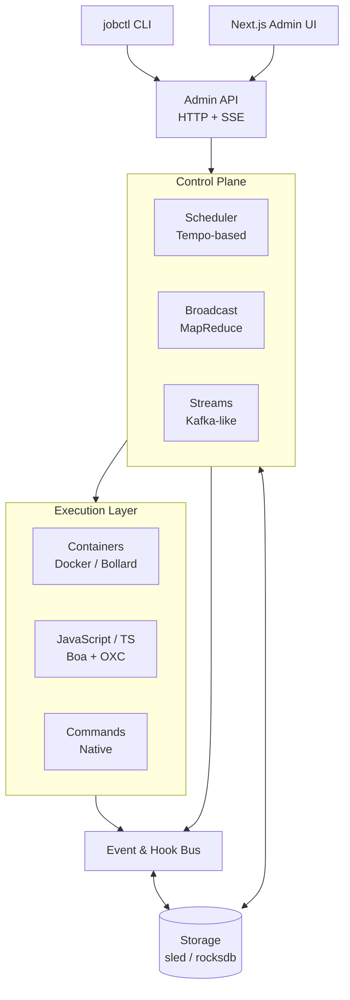
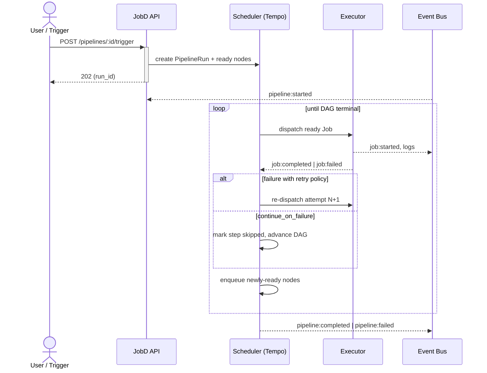

Introducing JobD - a distributed job orchestration and execution service built in Rust, designed for reliability, determinism, and extensibility. JobD takes the ergonomics of Cloud Run Jobs and puts them into a self-hostable cluster: submit a container, a shell command, or a JavaScript/TypeScript module, and JobD handles scheduling, retries, failover, fan-out, logs, and metrics across one or many nodes.

JobD is intentionally bigger than "just a job runner." It also ships DAG-based pipelines, broadcast/MapReduce, Kafka-like event streams, a JavaScript registration API, and a leaderless consensus protocol — all in a single Rust binary plus a Next.js admin UI.

## What is JobD?

JobD is a control-plane-plus-workers system for running finite units of work. Each unit — a **Job** — is a container, a shell command, or a JavaScript module, with a trigger (manual, cron, scheduled, delayed, event, or webhook), an execution policy (timeout, retries, resource limits), and an optional pipeline of downstream Jobs depending on it. JobD takes care of the rest.

What makes JobD distinct from the crowded job-runner space:

1. **Multiple first-class execution backends.** Containers via Docker (Bollard), JavaScript/TypeScript via the embedded [Boa](https://github.com/boa-dev/boa) engine with OXC transpilation, and native shell commands — all behind one API, one CLI, and one event bus.
2. **DAG pipelines with typed I/O.** Define a graph of Jobs, wire outputs into inputs, mark steps as `continue_on_failure`, attach retry policies per step. JobD walks the DAG and schedules ready nodes as their dependencies complete.
3. **Leaderless consensus (Tempo).** The cluster uses a [Tempo](https://vitorenes.org/publication/enes-tempo)-style consensus protocol — any node can accept writes, quorum-based fast/slow paths, no leader election to lose. Job scheduling and DAG state transitions get exactly-once semantics where possible.
4. **A real event system.** Every lifecycle moment (`jobd:job:started`, `jobd:pipeline:failed`, `jobd:leader:changed`, ...) is a first-class event. JavaScript jobs can subscribe; YAML hooks can fan them out to Slack, webhooks, or other JS modules.
5. **Kafka-like event streams built in.** Topics, partitions, consumer groups, offsets, batched consumers — without standing up a separate Kafka cluster just to wire two jobs together.

## Architecture



The control plane terminates the HTTP API (Axum), schedules Jobs via a Tempo-based consensus core, persists state to sled (or RocksDB), publishes lifecycle events on a shared bus, and dispatches work to the execution layer. The execution layer streams logs and status back through the bus. The Next.js admin app and `jobctl` CLI are both thin clients over the same Admin API.

## Job Types

### Container Jobs

Run any OCI-compatible image through the local Docker daemon. JobD handles pulls, environment, volumes, resource limits, GPU hints, and per-registry auth.

```yaml
name: build-image
type: container
image: docker:latest
command: ["docker", "build", "-t", "myapp", "."]
volumes:
  - source: ./src
    target: /app
environment:
  DOCKER_BUILDKIT: "1"
```

### JavaScript / TypeScript Jobs

Execute sandboxed JS or TS using the [Boa](https://github.com/boa-dev/boa) engine (Rust-native ECMAScript, ~94% Test262 conformance). TypeScript sources are transpiled on the fly with OXC before execution.

```javascript
// modules/process_data.js
export async function run(ctx) {
  ctx.log("Processing input:", ctx.input);
  const response = await jobd.http.fetch("https://api.example.com/data");
  return { status: "processed", result: response.body };
}
```

```yaml
name: process-data
type: js
module: process_data.js
```

### Command Jobs

Run native shell commands directly on the worker host — useful for backups, system maintenance, or wrapping existing tooling.

```yaml
name: backup-database
type: command
cmd: pg_dump
args: [-h, localhost, mydb]
environment:
  PGPASSWORD: secret
timeout_secs: 3600
```

## Pipelines

Pipelines stitch Jobs into a DAG. Each step declares its dependencies (`needs`), optionally consumes the previous step's output (`input_from`), and attaches its own failure policy. The pipeline itself can carry a cron schedule.

```yaml
name: nightly-report
schedule: "0 2 * * *"

jobs:
  fetch:
    type: js
    module: fetch_data.js

  transform:
    type: container
    image: transformer:latest
    needs: [fetch]
    input_from:
      job: fetch

  validate:
    type: command
    cmd: ./validate.sh
    needs: [transform]
    continue_on_failure: true

  publish:
    type: js
    module: publish_report.js
    needs: [validate]
    on_failure:
      type: retry
      max_attempts: 3
      backoff_ms: 5000
```

Pipeline lifecycle:



## Triggers

A Job can run on six different triggers; pipelines compose them at the step level too.

| Trigger     | Behavior                                                                                       |
|-------------|------------------------------------------------------------------------------------------------|
| *(none)*    | Runs immediately when submitted                                                                |
| `cron`      | Standard 5-field or 6-field cron, with timezone support                                        |
| `scheduled` | Fires once at a specific time                                                                  |
| `delayed`   | Fires after a delay                                                                            |
| `event`     | Fires when a matching internal or custom event is emitted on the bus                           |
| `webhook`   | Fires when JobD receives an inbound HTTP call                                                  |

## CLI - `jobctl`

`jobctl` is the everyday tool for interacting with a JobD cluster. It mirrors the Admin API one-to-one.

```bash
# health check
jobctl status

# submit jobs of each type
jobctl job create my-job -t command "echo 'Hello, World!'"
jobctl job create build-app -t container alpine:latest

# inspect
jobctl job list
jobctl job get <job-id>
```

For everything beyond ad-hoc usage — pipelines, schedules, broadcasts, stream topics — the HTTP API at `/api/v1/*` is the canonical surface, with the bundled **Next.js admin UI** as a visual frontend over the same endpoints.

## JavaScript Registration API

JS modules don't just run as one-shot Jobs — they can register *new* Jobs at runtime, attach them to crons or events, and tear them down again. This is JobD's answer to extensibility without restarts.

```javascript
// Register a cron-scheduled job from inside another JS job
jobd.register({
  name: "minute-ticker",
  function: "onTick",
  cron: "0 * * * * *",
  limit: 60,
  context: { message: "Tick!" }
});

// Register an event-triggered job
jobd.register({
  name: "failure-monitor",
  function: "onFailure",
  events: [
    jobd.events.internal.JOB_FAILED,
    "order:created"
  ]
});

// Tear it down later
jobd.deregister("minute-ticker");
```

The JS runtime also exposes a rich context object on every invocation (`ctx.log`, `ctx.input`, `ctx.env`, `ctx.labels`, `ctx.setOutput`) and a global `jobd` namespace covering logging, cluster info, child-job submission, HTTP, the datastore, broadcasts, and streams.

## Broadcast (enabling MapReduce-style operations)

Sometimes you need every node in the cluster to do something — collect metrics, scan a local cache, run a health check — and aggregate the results. JobD's broadcast API turns that into a single call.

```bash
curl -X POST http://localhost:8080/api/v1/broadcast \
  -H "Content-Type: application/json" \
  -d '{
    "name": "collect-metrics",
    "type": "javascript",
    "code": "function main(ctx) { ctx.setOutput({ node: ctx.job.nodeId, cpu: 42 }); }",
    "broadcast": { "wait_for_all": true, "timeout_secs": 60, "allow_partial_failure": true },
    "reduce": { "strategy": "collect" }
  }'
```

Reduce strategies cover the common cases: `collect`, `merge`, `sum`, `concat`, or a `custom` JS reducer. Results can be polled or streamed via Server-Sent Events from `/api/v1/broadcast/:group_id/stream`.

## Event Streams (Kafka-like)

For job-to-job communication that outgrows direct DAG edges, JobD ships a built-in streaming subsystem with the concepts you'd expect from Kafka.

| Concept          | Description                                                                                          |
|------------------|------------------------------------------------------------------------------------------------------|
| Topic            | Named event stream (e.g. `orders.created`)                                                           |
| Partition        | Ordered subset of a topic for parallelism                                                            |
| Producer         | A Job or API client publishing events                                                                |
| Consumer Group   | Set of consumers that share load — each event delivered to exactly one member of the group           |
| Offset           | Position in the stream, used for replay and resume                                                   |

A consumer is just a Job with a `stream` trigger:

```javascript
jobd.register({
  name: 'order-processor',
  stream: {
    topic: 'orders.created',
    consumerGroup: 'processors',
    startFrom: 'latest',
    batchSize: 10,
    batchTimeout: 5000
  },
  entrypoint: 'processOrders'
});

function processOrders(ctx) {
  for (const event of ctx.input.events) {
    ctx.log(`Processing: ${event.data.orderId} @ ${event.partition}:${event.offset}`);
  }
  ctx.streams.commit();
  ctx.setOutput({ processed: ctx.input.events.length });
}
```

This unlocks the usual patterns — fan-out, competing-consumer work queues, multi-stage stream processing, saga orchestration — without needing a separate Kafka or NATS deployment.

## Distributed Mode

For high availability and horizontal capacity, JobD runs as a cluster:

```yaml
cluster:
  enabled: true
  bootstrap_peers:
    - "node1:7800"
    - "node2:7800"
    - "node3:7800"
  quorum_size: 2
  heartbeat_interval_ms: 1000
  failure_timeout_ms: 5000
```

The cluster uses a **leaderless Tempo consensus protocol** for:

- Multi-master replication (any node can accept writes)
- Quorum-based coordination with fast and slow paths
- Job scheduling decisions with exactly-once semantics where possible
- DAG state transitions
- No leader election to lose under partition

Storage is pluggable between **sled** (default) and **RocksDB** (via the `rocksdb-storage` feature). Both back the same job state, pipeline definitions, stream partitions, and consumer offsets.

## How I Use JobD

The honest origin story: I have a gaming PC with an RTX 4090 sitting in the corner of my apartment. It's a substantial pile of compute that, by default, is doing absolutely nothing whenever I'm not playing a game on it — which is most of the time.

I wanted to put that GPU to work on AI workloads. The "sane" path would have been to SSH into the box, `tmux` into a session, manually start an Ollama server or a Hugging Face inference script, remember to tear it down, scrape logs by hand, and repeat that dance every time I wanted to run something. That's exactly the kind of friction I didn't want.

So I run JobD on the 4090 box instead. My laptop and the cloud services for [M2W.ai](/projects/m2w-ai) submit Jobs to it over the network. The 4090 becomes "just another node in the cluster" — except it happens to be the one with all the GPU memory.

In practice, the workloads I run on it fall into a few buckets:

- **Local LLM inference via Ollama** — scheduled and on-demand Jobs that spin up Ollama with a specific model, run a batch of prompts, and return results. Great for anything where I'd rather not pay per-token to a hosted API.
- **Hugging Face model runs** — container Jobs that pull a model, run inference or fine-tuning, push artifacts to object storage, then exit cleanly so the GPU is free for the next thing.
- **M2W.ai background workflows** — embedding generation, evaluation runs, periodic data-processing pipelines that benefit from local GPU rather than spending money on cloud inference.
- **Personal robotics workflows** — vision model inference, dataset preprocessing, and the occasional training run for projects I'm tinkering on outside of work.

The result is that I never SSH into the gaming PC anymore. I submit a Job (or let cron fire one), the events bus tells me when it finishes, logs stream back over the API, and the GPU goes back to idling until the next thing needs it. Same hardware, no manual operator overhead — which is exactly the point of building JobD in the first place.

## Observability

Operability was a first-class concern from day one:

- **Structured logging** via `tracing` + `tracing-subscriber`, JSON or pretty formats
- **Prometheus metrics** at `/metrics` (port `9090` by default) — `jobd_jobs_scheduled_total`, `jobd_jobs_completed_total`, `jobd_jobs_failed_total`, `jobd_jobs_running`, `jobd_job_duration_milliseconds`, `jobd_pipelines_started_total`, `jobd_queue_depth`, `jobd_cluster_nodes`
- **Distributed tracing** with an optional OpenTelemetry-style endpoint (Jaeger, Tempo, etc.)
- **Hooks** to forward any subset of events to webhooks or JS modules — Slack notifications, custom alerting, post-job cleanup

## Why not just use Kubernetes `Job` / `CronJob`?

If you already operate a Kubernetes cluster, K8s `Job` and `CronJob` are fine for batch work. JobD targets the case where you *don't* want to stand up a full cluster (and its operational tax — control plane HA, networking plugins, storage drivers, ongoing upgrades) just to run scheduled containers across a few machines. You get jobs, pipelines, retries, fan-out, and HA in a single binary with a control plane you can read end-to-end.

JobD also goes further than K8s `Job` in a few directions that matter for application-level orchestration: first-class JavaScript execution, DAG pipelines with typed I/O, broadcast/MapReduce, and an event-stream subsystem — without needing Argo Workflows, Knative, and Kafka layered on top.

## Why not just use Cloud Run Jobs?

Cloud Run Jobs is excellent if you're on GCP and happy to stay there. JobD borrows its mental model (containers, tasks, retries, parallelism) but is portable: laptop, single VM, or production cluster — same binary, same API, no vendor lock-in. The DAG pipelines, event streams, and JS sandbox are also things you'd have to assemble out of multiple GCP products.

## Release Plan

JobD is at **v0.3.4** today. Active focus areas:

- Hardening the Tempo consensus paths under partition and load
- Filling in the API auth story (currently a placeholder middleware — production deployments should sit behind a proxy)
- Expanding the admin UI for pipelines, broadcasts, and stream inspection
- More execution backends (containerd, WebAssembly)
- Stable 1.0 once the API and storage formats settle

> **Availability.** JobD is currently **closed-source** while I finish stabilising the API and pulling internal tooling out of the tree. The repo at [github.com/dgate-io/jobd](https://github.com/dgate-io/jobd) is private today, but I plan to **open-source it in June under the MIT license** — at which point the repo, examples, and documentation will be public and contributions welcome.

Thank you for reading! If you've ever tried to wire batch jobs across a few machines and bounced off the complexity of Kubernetes — or fought a homegrown cron-on-cron-on-Bash setup — I'd love to hear about your use case.
